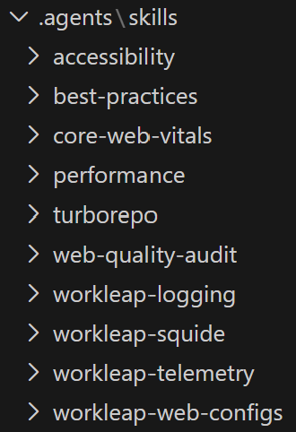

# Setup code review workflow

Review agents can be extended with additional capabilities to better understand your coding tools and libraries. This guide describes a basic setup for configuring review agents to use agent skills and improve the code review workflow.

## Choosing an agent

After several [rounds of testing](https://github.com/workleap/wl-agents-code-review-poc), the current recommendation is to use one, or both, of the following agents:

- [Copilot](https://copilot.microsoft.com/), due to its ease of configuration, consistent issue detection, and well-structured reporting format.
- [Claude Code](https://code.claude.com/docs/en/overview), without the [code-review](https://github.com/anthropics/claude-code/blob/main/plugins/code-review/README.md) plugin, for faster execution times and access to newer AI features.

To enhance the code review workflow with agent skills, complete the following steps :point_down:

## Create an agent file

First, create an `AGENTS.md` file at the root of the workspace or update an existing agent file with the following content:

```md AGENTS.md
## Code Review Instructions

### Agent skills

During code reviews, load and apply agent skills from the `./.agents/skills` folder as described below.

#### Always apply

Apply these skills to every changed line in `.ts`, `.tsx`, `.js`, and `.jsx` files:

* `/accessibility`
* `/best-practices`
* `/core-web-vitals`
* `/performance`

#### Apply based on imports

Apply the following skills to changed lines only, based on detected imports:

* Files importing `@squide/*` → `/workleap-squide`
* Files importing `@workleap/logging` → `/workleap-logging`
* Files importing `@workleap/telemetry` → `/workleap-telemetry`
* Files importing
  `@workleap/browserslist-config`,
  `@workleap/eslint-configs`,
  `@workleap/stylelint-plugin`,
  `@workleap/typescript-configs`,
  `@workleap/rsbuild-configs`,
  `@workleap/rslib-configs`
  → `/workleap-web-configs`
* Files importing `react-aria-components` → `react-aria`

#### Apply based on file name or type

* `turbo.json` → `/turborepo`

### Issue reporting

When reporting issues:

* If an issue corresponds to a specific agent skill or a custom guideline, reference it explicitly.
* Otherwise, assign the issue to the most relevant category based on its nature.
```

Then, update the [agent skills](https://workleap.github.io/wl-idp-docs-hub/ai/setup-agent-extensions/) to align with the project's technology stack.

## Setup Copilot

When using Copilot, add a `.github/copilot-instructions.md file and include the content below:

```md .github/copilot-instructions.md
This repository's instructions are defined in the root `AGENTS.md` file. GitHub Copilot and any other tools that read `.github/copilot-instructions.md` should treat `AGENTS.md` as the single source of truth.
```

## Setup Claude Code

When using Claude Code, first create a `CLAUDE.md` file at the root of the workspace with the following content:

```md CLAUDE.md
This repository's instructions are defined in the root `AGENTS.md` file. Claude Code and any other tools that read `CLAUDE.md` should treat `AGENTS.md` as the single source of truth.
```

Then, create a `.github/workflows/claude-code-review.yml` file with the following content:

```yaml .github/workflows/claude-code-review.yml
name: Claude Code Review

concurrency:
  group: claude-code-review-${{ github.event.pull_request.number }}
  cancel-in-progress: true

on:
  pull_request:
    branches: ["main"]
    types: [opened, synchronize, ready_for_review, reopened]

jobs:
  claude-review:
    # Skip drafts.
    if: ${{ !github.event.pull_request.draft }}

    runs-on: ubuntu-latest
    permissions:
      contents: read
      pull-requests: write
      issues: write
      # Required for OIDC authentication: https://github.com/anthropics/claude-code-action/blob/main/docs/faq.md#why-am-i-getting-oidc-authentication-errors.
      id-token: write

    steps:
      - name: Checkout repository
        uses: actions/checkout@v5
        with:
          # Provides better git history context than "1".
          fetch-depth: 0

      - name: Run Claude Code Review
        id: claude-review
        uses: anthropics/claude-code-action@v1
        with:
          anthropic_api_key: ${{ secrets.ANTHROPIC_API_KEY }}
          prompt: |
            REPO: ${{ github.repository }}

            Review PR #${{ github.event.pull_request.number }} for bugs, security issues, and code quality problems.
            Get the diff: gh pr diff ${{ github.event.pull_request.number }}

            IMPORTANT:
            - You must read and follow the review instructions defined in the root AGENTS.md file.

            RULES:
            - Only report definite issues introduced by this change (not pre-existing ones).
            - Every reported issue must include a clear fix, with the file path and line number.
            - Skip style preferences, minor nitpicks, and issues typically caught by linters.
            - Do not include positive feedback; focus only on problems.

            SEVERITY:
            - Critical (data loss/security breach), High (incorrect behavior), Medium (conditional issues), Low (minor/typos).

            REPORTING:
            - All issues must be reported as inline pull request comments using GitHub MCP.
          claude_args: >-
            --allowed-tools
            "Read,Write,Grep,Glob,Skill,Task,
             Bash(gh pr *),
             mcp__github_inline_comment__*"
```

Then, add `ANTHROPIC_API_KEY` as a [KeyVault secret](https://workleap.atlassian.net/wiki/spaces/TL/pages/5211226436/How+to+use+managed+secrets+in+your+pipeline) or a [GitHub action secret](https://docs.github.com/en/actions/how-tos/write-workflows/choose-what-workflows-do/use-secrets).

!!!info
The previous workflow does not use the [code-review](https://github.com/anthropics/claude-code/blob/main/plugins/code-review/README.md) plugin. Our tests showed that enabling the plugin often results in reviews costing above $4 per pull request. This is because the plugin creates a pool of four agents that work together to review the changes. Our testing indicates that acceptable review quality can be achieved without the plugin, at a lower cost.
!!!

## Install agent skills

Finally, using [skills.sh](https://skills.sh/), install into the repository the agent skills listed in the `AGENTS.md` file.

:::align-image-left
{width=220}
:::

## Try it :rocket:

Deliberately add changes that should trigger the installed agent skills, then open a pull request. The review agent should report issues as inline comments on the pull request.
